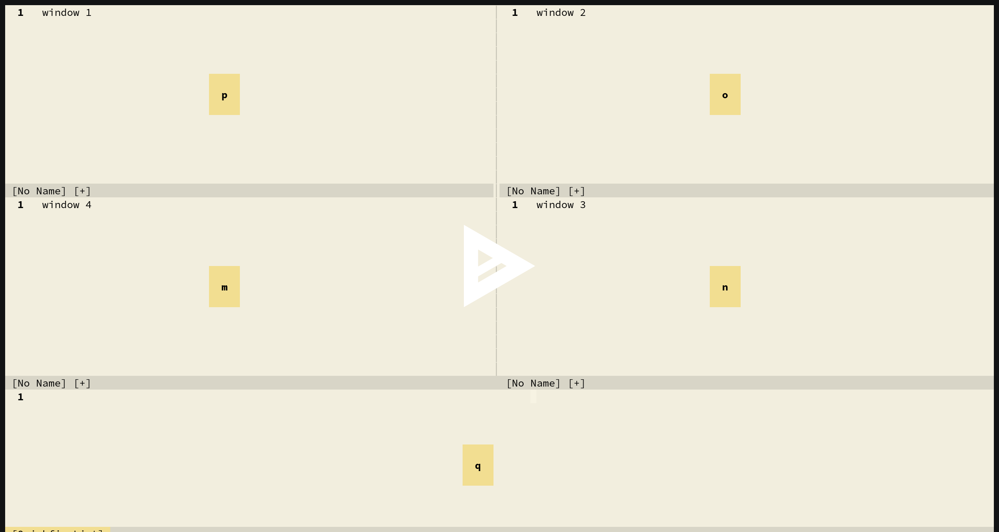

# nvim-window

A simple and opinionated NeoVim plugin for switching between windows in the
current tab page.

In (Neo)Vim you can navigate between windows using `Control+W`, followed by a
motion. For example, to move to the window on the right of the current one you'd
press `Control+W l`. This works for simple scenarios, but gets annoying fast.
Consider the following window layout:

```
+---+---+---+---+
|   |   |   |   |
| A | B | C | D |
|   |   |   |   |
+---+---+---+---+
```

Assuming window A is the current window your cursor is in, and you want to move
to window C, you might press `Control+W 2l`. This is doable, but having to count
the number of steps every time gets tedious.

It gets more annoying when you want to move to a window above your current one,
but the window is on the right:

```
+---+---+---+
|   |   |   |
| A | B | C |
|   |   |   |
+---+---+---+
|     D     |
+-----------+
```

Assuming window D is active and you want to move to window B, you'd have to take
two steps:

- `Control+W k` to move to window A
- `Control+W l` to move to window B

While there may be other ways of doing this, the use of `Control+W` is probably
the easiest approach to remember; and it's still annoying.

This is where nvim-window comes in: it makes it trivial to jump between windows
(in the current tab page), without the need for knowing how far away they are or
relying on a fuzzy finder (and having to type out the window paths).

Using nvim-window, press your binding of choice to activate nvim-window, press
one letter (or two, if there are many windows), and the given window becomes
active. This makes it _much_ easier to quickly jump between windows.

You can see this in action here:

[](https://asciinema.org/a/424318)

## Requirements

NeoVim 0.5 or newer

## Limitations

- Limited styling options to keep the code simple
- "Only" handles up to 52 windows in a single tab page
- No hinting of characters as you type (like hop.nvim), to keep the code simple

## Installation

First add this plugin using your plugin manager of choice. For example, using
vim-plug:

```vim
Plug 'https://gitlab.com/yorickpeterse/nvim-window.git'
```

For the exact steps necessary, please refer to your plugin manager's
documentation.

Once installed you need to add a key binding, as nvim-window doesn't define any
key bindings for you. You can set up a binding like so:

```vim
map <silent> <leader>w :lua require('nvim-window').pick()<CR>
```

## Configuration

The default settings should be good enough for most. In case you want to change
them (e.g. by changing the background of the floating window), you can do so as
follows:

```lua
require('nvim-window').setup({
  -- The characters available for hinting windows.
  chars = {
    'a', 'b', 'c', 'd', 'e', 'f', 'g', 'h', 'i', 'j', 'k', 'l', 'm', 'n', 'o',
    'p', 'q', 'r', 's', 't', 'u', 'v', 'w', 'x', 'y', 'z'
  },

  -- A group to use for overwriting the Normal highlight group in the floating
  -- window. This can be used to change the background color.
  normal_hl = 'Normal',

  -- The highlight group to apply to the line that contains the hint characters.
  -- This is used to make them stand out more.
  hint_hl = 'Bold',

  -- The border style to use for the floating window.
  border = 'single'
})
```

You can place this in your `init.lua` before or after defining the mapping. You
can also dump it in a different Lua file; just make sure to actually load that
file :)

If you want to replicate the style from the recording, use the following
settings:

```lua
require('nvim-window').setup({
  normal_hl = 'BlackOnLightYellow',
  hint_hl = 'Bold',
  border = 'none'
})
```

You then have to define the `BlackOnLightYellow` highlight group somewhere using
these settings:

```vim
hi BlackOnLightYellow guifg=#000000 guibg=#f2de91
```

The theme used is [vim-paper](https://gitlab.com/yorickpeterse/vim-paper), which
has this highlight group built-in.

## License

All source code in this repository is licensed under the Mozilla Public License
version 2.0, unless stated otherwise. A copy of this license can be found in the
file "LICENSE".
